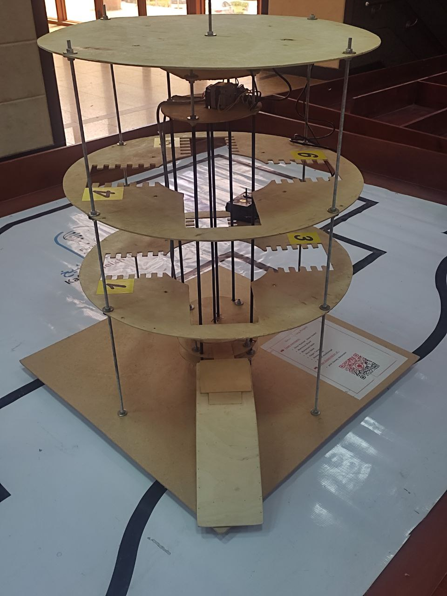
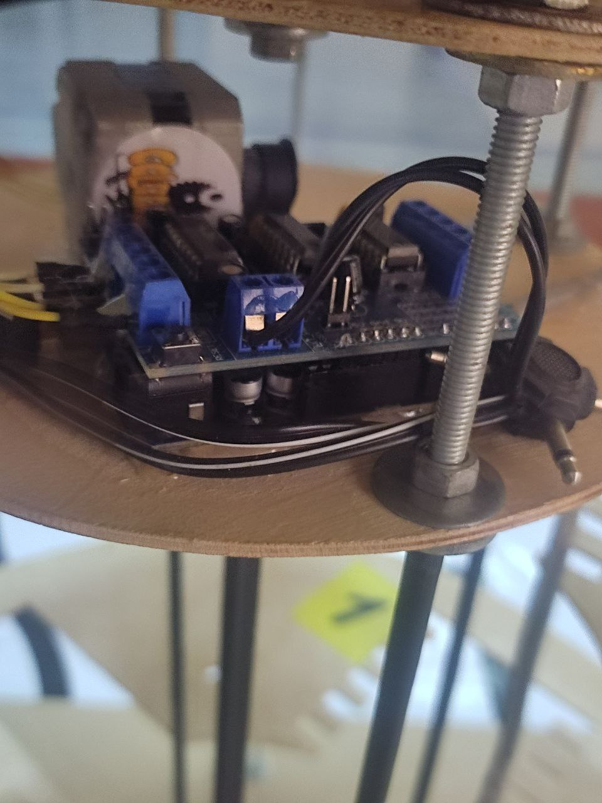

# Smart Parking System

##### Fully Smart Automated Parking system  (Software & Hardware  with GUI as well!)  made for prof.hamdy Digital Control Course . this project 

<em>  ✨Main project parts </em> 

	
  1. _Hardware_   structure , motors , controller , pullies , belt , cables 
  2. _CV_  
  3. _OCR_ 
  4. _Sqlite DB_ 
  5. _Arduino/python code_  
  6. _GUI tkinter code_

 
 
 
---

> ### 📣 Beta (v2.0) is out!
 * Gmail is now connected to our Database
 * EXE version is out now! just download setup file connect to arduino then youre ready to go!
 * (SOON) audio visuals & OCR ID motion tracker!
 * ~~some bugs fixed~~
 
 

 
 

---
> ## 🔩 Hardware :
 
 
 
---

> ###  🛠 Issues & Notes:
*  OCR ID detect box not altering color with change of ID angle
*  first release comming very soon

 
 
 
 
 
 

---

> ##### 🧾 About the project: 
  
  * [Sources & Docs](docs/sources&links.md)

  * [Modules & tools](imports&tools.md)

  * [Hardware Components](Hardware_components.md) 

